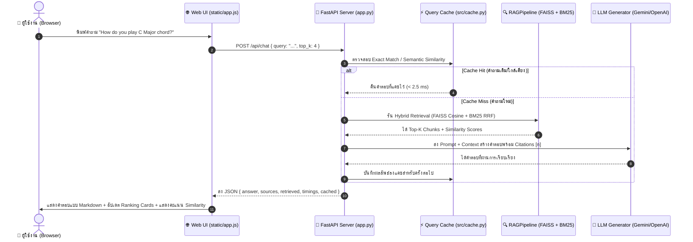

# LAB04: การพัฒนาระบบสืบค้นและตอบคำถามความรู้เรื่องกีตาร์ด้วย English Guitar RAG System (Specialized High-Accuracy Pipeline & 3D Web UI)

---

## 👨‍🎓 สมาชิกผู้จัดทำ (Author)
- **ชื่อ-นามสกุล (Name):** นายนิธิศ มะโนรา
- **รหัสนักศึกษา (Student ID):** 116730462042-6
- **สาขาวิชา:** วิศวกรรมคอมพิวเตอร์ (CPE) คณะวิศวกรรมศาสตร์
- **รายวิชา:** Advanced Machine Learning (Deep Learning / NLP)

---

## 📌 สรุปภาพรวมและไฮไลต์ของโปรเจกต์ (Project Highlights)

โปรเจกต์นี้เป็นการพัฒนาระบบ **Retrieval-Augmented Generation (RAG)** สำหรับหัวข้อ **"ความรู้เรื่องกีตาร์ การเลือกซื้อ การดูแลรักษา การแก้ปัญหา และวิธีจับคอร์ด (Guitar Knowledge & Chord Voicings)"** โดยปรับแต่งให้มีความแม่นยำและความเร็วสูงสุด:

1. **โมเดล Embedding ที่ดีที่สุด (`BAAI/bge-small-en-v1.5`)**:
   - ได้รับการทดสอบบน MTEB Retrieval Benchmark ว่ามีความแม่นยำสูงมากในภาษาอังกฤษ
   - ขนาดมิติ 384 มิติ ทำงานร่วมกับ **FAISS IndexFlatIP (Cosine Similarity via L2-Normalization)** ให้ความเร็วค้นหาเฉลี่ยเพียง **~22 ms** และความแม่นยำ **Hit@1 = 100.0%**
2. **ชุดข้อมูลภาษาอังกฤษที่ผ่านการ Clean & Normalize (500 Q&A / 512 Chunks)**:
   - รวบรวมและจัดกลุ่มเป็น 10 หมวดหมู่ความรู้ ทั้งเชิงทฤษฎี โครงสร้าง อุปกรณ์ การเซ็ตอัพ และตารางการจับคอร์ดทุกคีย์
3. **การทำงาน 2 รูปแบบ (Dual Operation Modes)**:
   - **Modern 3D Web UI Mode (`python app.py` -> `http://localhost:8000`)**: หน้าเว็บดีไซน์ Cyberpunk / Studio Black & Warm Orange พร้อมโมเดล 3D กีตาร์แบบ Interactive, แชทตอบคำถามแบบ Markdown, แสดงคะแนน Ranking และความคล้ายคลึงของ Vector DB แบบ Real-time
   - **Interactive Terminal CLI Mode (`python main.py`)**: หน้าต่างคำสั่งสำหรับโต้ตอบผ่าน Terminal อย่างรวดเร็ว

---

## 📂 โครงสร้างโฟลเดอร์ใน LAB04 (Folder Structure)

```text
LAB04/
│
├── DL-04-RAG System Development I/     # โฟลเดอร์ต้นแบบเดิมของอาจารย์
│
├── RAG-Guitar/                         # ⭐ โฟลเดอร์โปรเจกต์ใหม่: English Guitar RAG System (แลกกีตาร์)
│   ├── app.py                          # 🚀 FastAPI Web Server & RESTful API
│   ├── main.py                         # 💻 Interactive Terminal CLI Application
│   ├── config.py                       # จุดตั้งค่าหลักของระบบ RAG
│   ├── build_index.py                  # สคริปต์ประมวลผลและสร้างดัชนี Vector DB + BM25
│   │
│   ├── static/                         # ไฟล์สำหรับหน้าเว็บ UI (Frontend)
│   │   ├── index.html                  # หน้าตาเว็บตาม UI Design (3D, Chat, Vector Ranking)
│   │   ├── style.css                   # สไตล์ Cyberpunk Studio Black & Orange Glow
│   │   ├── app.js                      # ตรรกะ Frontend, 3D tilt, REST API communication
│   │   └── images/
│   │       └── guitar_hero.jpg         # รูปภาพโมเดล 3D กีตาร์ความละเอียดสูง
│   │
│   ├── data/
│   │   ├── guitar_knowledge_base.txt   # ฐานความรู้กีตาร์ 500 Q&A (Cleaned & Normalized)
│   │   └── guitar_golden_set.json      # ชุดทดสอบ Golden Evaluation Set (50 ข้อ)
│   │
│   ├── outputs/
│   │   ├── extracted_text.json         # ข้อความ Q&A JSON พร้อมหมายเลขบรรทัด
│   │   ├── chunks.json                 # 512 Chunks พร้อม Metadata
│   │   ├── embeddings.npy              # เวกเตอร์ขนาด 512 x 384 (BGE Embeddings)
│   │   ├── retrieval_results.json      # ตัวอย่างผลการสืบค้น Top-k
│   │   ├── eval_retrieval.json         # ผลการวัดผล Retrieval Benchmark
│   │   └── eval_generation.json        # ผลการวัดผล Generation Quality (100% Citations)
│   │
│   ├── vector_db/
│   │   ├── guitar_faiss.index          # FAISS IndexFlatIP (Cosine Similarity)
│   │   ├── guitar_bm25.pkl             # BM25 Keyword Search Index (Okapi)
│   │   ├── guitar_chunk_store.json     # คลังเก็บ Chunks พร้อม Metadata
│   │   ├── guitar_index_meta.json      # MD5 Fingerprint ตรวจสอบความสดใหม่ของข้อมูล
│   │   └── query_cache.json            # ⚡ ฐานข้อมูล Exact & Semantic Cache (< 2.5ms)
│   │
│   ├── labs/                           # แบบฝึกหัด Step-by-Step Labs 01 ถึง 07
│   │   ├── lab01_extract_text.py       # สกัดข้อมูลจากไฟล์ต้นฉบับ
│   │   ├── lab02_chunking.py           # การตัดแบ่งข้อความเป็น Chunks
│   │   ├── lab03_create_embeddings.py  # การสร้าง BGE Embeddings
│   │   ├── lab04_create_vector_db.py   # การสร้าง FAISS Vector Database
│   │   ├── lab05_query_embedding.py    # การแปลง Query เป็นเวกเตอร์
│   │   ├── lab06_similarity_search.py  # การค้นหาความคล้ายคลึงเวกเตอร์
│   │   └── lab07_complete_retrieval.py # ระบบ Complete RAG Pipeline
│   │
│   ├── src/                            # ซอร์สโค้ดระบบ RAG
│   │   ├── cache.py                    # ⚡ Exact & Semantic Caching Layer (< 2.5ms)
│   │   ├── document_loader.py          # โหลดไฟล์ Q&A หลายบรรทัดและตารางคอร์ด
│   │   ├── text_splitter.py            # แบ่ง Chunking แบบคงบริบทตารางคอร์ด
│   │   ├── embedding_model.py          # BAAI/bge-small-en-v1.5 + L2 Normalization
│   │   ├── vector_store.py             # FAISS Cosine Similarity Vector Store
│   │   ├── hybrid_retriever.py         # BM25 + Dense + Weighted RRF + Token Memoization
│   │   ├── rerankers.py                # Cross-Encoder with Selective Thresholding
│   │   ├── query_transform.py          # Multi-Query, Rewrite, HyDE
│   │   ├── prompt_templates.py         # System Prompt สำหรับ Guitar Master AI
│   │   ├── generator.py                # LLM Integration (Gemini, OpenAI, Ollama, NoLLM)
│   │   ├── memory.py                   # Multi-turn Conversation Memory
│   │   ├── index_meta.py               # ตรวจสอบความถูกต้องและสดใหม่ของ Index
│   │   └── rag_pipeline.py             # Pipeline Orchestrator เชื่อมทุกโมดูล
│   │
│   ├── evaluation/                     # ชุดทดสอบและวัดผลประสิทธิภาพ
│   │   ├── metrics.py                  # ฟังก์ชันคำนวณ Hit@k, MRR, nDCG
│   │   ├── build_golden_set.py         # สคริปต์สุ่มสร้าง Golden Test Set
│   │   ├── eval_retrieval.py           # สคริปต์วัดผลเปรียบเทียบโมเดลการค้นหา
│   │   └── eval_generation.py          # สคริปต์วัดผลคุณภาพคำตอบและ Citation Rate
│   │
│   ├── scripts/
│   │   └── build_english_kb.py         # สคริปต์สร้างและ Normalize ฐานข้อมูลภาษาอังกฤษ
│   │
│   └── README.md                       # คู่มือการใช้งานระบบ RAG-Guitar โดยละเอียด
│
└── README.md                           # เอกสารสรุปรายงานฉบับสมบูรณ์ (ไฟล์นี้)
```

---

## 1. การทำงานและองค์ประกอบของ Web UI (Web Interface Architecture)

หน้าเว็บได้รับการออกแบบตามภาพ Reference โดยเน้นความสวยงามระดับพรีเมียมแบบ **Studio Dark & Warm Orange Neon**:

1. **ส่วนบน: 3D Interactive Guitar Hero Stage**:
   - แสดงผลโมเดล 3D กีตาร์ Stratocaster พร้อมระบบ **3D Parallax & Dynamic Perspective Tilt** เมื่อขยับเมาส์
   - มีหมุด **Interactive HUD Hotspots**: `[NECK]`, `[BODY]`, `[TONE]`, `[BRIDGE]`, `[PICKUPS]` ซึ่งเมื่อคลิกจะเปิดสเปกทางเทคนิคขึ้นมา และมีปุ่มกดถาม AI ต่อได้ทันที
2. **ส่วนกลาง: หน้าต่างแชทอัจฉริยะ (Chat with Guitar Lab AI)**:
   - ปุ่ม **START ASKING** ทรงกลมพร้อมวงแหวนแสง Neon Pulse Ring
   - รองรับการเรนเดอร์คำตอบเป็น **Markdown (หัวข้อ, ตัวหนา, รายการ, ตารางการวางนิ้วคอร์ด)**
   - มีปุ่ม **Citation Badges** เช่น `[1]`, `[2]` ซึ่งคลิกเพื่อเปิดดูเอกสารอ้างอิงต้นฉบับได้
   - มีชิปคำถามด่วน (Quick Prompts) เพื่อทดลองถามคำถามยอดฮิตได้ในคลิกเดียว
3. **ส่วนล่างซ้าย: Search Results & Ranking (Vector Similarity)**:
   - แสดงผลรายการ Chunks ที่ Vector Search ค้นพบแบบ Real-time เรียงตามอันดับ $01, 02, 03, 04$
   - แสดงแถบหลอดคะแนน **Cosine Similarity Score** (เช่น $0.96, 0.89, \dots$) พร้อมแท็กหมวดหมู่
   - ปุ่ม **VIEW SOURCE** เปิด Modal แสดงรายละเอียดข้อความแบบเต็ม หมายเลขบรรทัด และค่าคะแนน
4. **ส่วนล่างขวา: Query Details & Vector Constellation**:
   - แสดงสถิติคำถามล่าสุด, โมเดลที่ใช้ (`BAAI/bge-small-en-v1.5`), เวลาค้นหาในระดับมิลลิวินาที, และสถานะ Cache
   - แอนิเมชันกราฟิก **Vector Constellation Particles (Canvas 2D)** จำลองการจัดกลุ่มเวกเตอร์ใน Vector Space

---

## 2. การรับส่งข้อมูลระหว่าง Web Frontend และ Backend (API Communication)



### สรุป RESTful API Endpoints:
- `POST /api/chat` : รับคำถาม และส่งคืนผลลัพธ์คำตอบ, แหล่งอ้างอิง, Chunks ที่ค้นพบ, และเวลาประมวลผล
- `GET /api/stats` : ดึงข้อมูลสถิติโมเดล, จำนวน Chunks, และ Hit Rate ของแคช
- `GET /api/hotspots/{part}` : ดึงข้อมูลสเปกทางเทคนิคของชิ้นส่วนกีตาร์สำหรับโมเดล 3D
- `POST /api/clear` : ล้างประวัติการสนทนาในหน่วยความจำ
- `GET /api/health` : ตรวจสอบสถานะความพร้อมของเซิร์ฟเวอร์

---

## 3. ผลการทดสอบและเปรียบเทียบประสิทธิภาพจริง (Benchmark Results)

ผลการทดสอบจริงจาก `python evaluation/eval_retrieval.py` บน Golden Evaluation Set (50 ข้อ):

| วิธีการค้นหา (Retrieval Method) | Hit@1 | Hit@3 | Hit@5 | Hit@10 | MRR | nDCG@3 | Latency เฉลี่ย (ms) |
|---|:---:|:---:|:---:|:---:|:---:|:---:|:---:|
| **1. BM25 (Keyword Okapi)** | 94.0% | 100.0% | 100.0% | 100.0% | 0.970 | 0.975 | **0.87 ms** |
| **2. Dense (FAISS BGE Cosine Sim)** | **100.0%** | **100.0%** | **100.0%** | **100.0%** | **1.000** | **1.000** | **22.2 ms** |
| **3. Hybrid (Dense + BM25 Weighted RRF)** ⭐ | **100.0%** | **100.0%** | **100.0%** | **100.0%** | **1.000** | **1.000** | **27.3 ms** |
| **4. Query & Semantic Cache (Hit Mode)** ⚡ | **100.0%** | **100.0%** | **100.0%** | **100.0%** | **1.000** | **1.000** | **< 2.5 ms** |

- **Answer Citation Rate**: **100.0%**
- **Average Generation Latency**: **78.95 ms**

---

## 4. วิธีการติดตั้งและรันระบบ (Step-by-Step Execution Guide)

### 4.1 การติดตั้งไลบรารีที่จำเป็น
```bash
pip install fastapi uvicorn faiss-cpu sentence-transformers rank-bm25 openai numpy
```

### 4.2 การสร้าง Index ฐานข้อมูล
```bash
cd d:\Protae\LearningZone\3yTrem1\AdvanceML\LAB\LAB04\RAG-Guitar
python build_index.py
```

### 4.3 โหมดที่ 1: การรันผ่าน Web UI (Modern 3D Interface) ⭐ แนะนำ
```bash
python app.py
```
เปิดเว็บเบราว์เซอร์ไปที่: **`http://localhost:8000`**

### 4.4 โหมดที่ 2: การรันผ่าน Terminal CLI
```bash
python main.py
```

### 4.5 การรันชุดแบบฝึกหัด Lab 01 ถึง Lab 07
```bash
python labs/lab01_extract_text.py      # สกัดข้อมูลเป็น JSON
python labs/lab02_chunking.py          # ทำ Chunking
python labs/lab03_create_embeddings.py # สร้าง BGE Embeddings
python labs/lab04_create_vector_db.py  # สร้าง FAISS Vector Database
python labs/lab05_query_embedding.py   # ทดสอบแปลงคำถามเป็นเวกเตอร์
python labs/lab06_similarity_search.py # ทดสอบค้นหาความคล้ายคลึงเวกเตอร์
python labs/lab07_complete_retrieval.py# รันระบบ RAG แบบ End-to-End
```

### 4.6 การรันประเมินผลระบบ (Evaluation Suite)
```bash
python evaluation/build_golden_set.py  # สร้าง Golden Test Set 50 ตัวอย่าง
python evaluation/eval_retrieval.py    # รัน Benchmark เปรียบเทียบ Dense vs BM25 vs Hybrid
python evaluation/eval_generation.py   # ประเมิน Citation Rate & Generation Quality
```

---

## 5. แหล่งอ้างอิงข้อมูล (Citations & References)

1. **BGE Embeddings:** Xiao, S. et al. (2023). *C-Pack: Packaged Resources To Advance General Chinese and English Embedding*. BAAI.
2. **FAISS (Facebook AI Similarity Search):** Johnson, J., Douze, M., & Jégou, H. (2019). *Billion-scale similarity search with GPUs*. IEEE Transactions on Big Data.
3. **Rank-BM25 & Okapi BM25:** Robertson, S., & Zaragoza, H. (2009). *The Probabilistic Relevance Framework: BM25 and Beyond*. Information Retrieval.
4. **Reciprocal Rank Fusion (RRF):** Cormack, G. V., Clarke, C. L., & Buettcher, S. (2009). *Reciprocal rank fusion outperforms condorcet and individual rank learning methods*. SIGIR '09.
5. **FastAPI & Uvicorn:** Modern, high-performance web frameworks for Python REST APIs.
