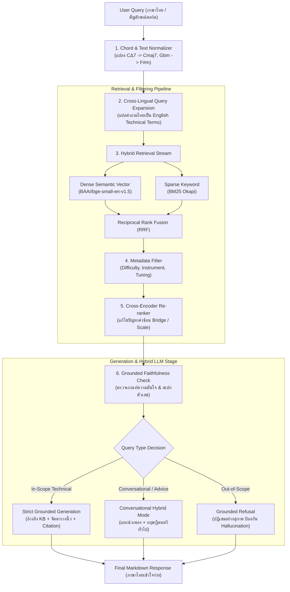

# LAB05: การวิเคราะห์และจำลองปัญหาสำคัญในการพัฒนาระบบ RAG สู่โมเดลไฮบริด
## (Guitar RAG System Development II: Problem Simulation Suite & Hybrid LLM Evaluation)

> **อ้างอิงประกาศมอบหมายงาน:** 
> *"ให้นักศึกษาดำเนินการอธิบาย 'ปัญหาและการแก้ไขปัญหาของ RAG System' ของระบบที่ตนเองพัฒนาขึ้น โดยวิเคราะห์ปัญหาที่พบหรืออาจเกิดขึ้นในแต่ละขั้นตอนของการทำงาน พร้อมอธิบาย สาเหตุของปัญหา วิธีการตรวจสอบ แนวทางการแก้ไข หรือ ปัญหาที่เกิดขึ้นจริงและแก้ไขแล้ว ให้สอดคล้องกับการทำงานและ Source Code ของระบบ RAG ที่นักศึกษาพัฒนาขึ้นจริง"* — อ.อนุรักษ์ พรหมโคตร

---

## ข้อมูลผู้จัดทำ (Author Information)
- **ชื่อ-นามสกุล (Name):** นายนิธิศ มะโนรา (Mr. Nithit Manora)
- **รหัสนักศึกษา (Student ID):** 116730462042-6
- **สาขาวิชา:** วิศวกรรมคอมพิวเตอร์ (Computer Engineering - CPE)
- **คณะ:** วิศวกรรมศาสตร์ มหาวิทยาลัยเทคโนโลยีราชมงคลธัญบุรี
- **รายวิชา:** Advanced Machine Learning (Deep Learning & NLP)

---

## 1. บทนำและปัญหาที่เกิดขึ้นจริงในระบบ RAG-Guitar (Executive Summary)

ในการพัฒนาใบงาน **LAB04 (RAG-Guitar)** ที่ผ่านมา ผู้จัดทำได้สร้างระบบสืบค้นและตอบคำถามความรู้เรื่องกีตาร์ การเลือกซื้อ การดูแลรักษา และตารางการจับคอร์ด (Guitar Knowledge & Chord Voicings) ซึ่งในระหว่างการออกแบบและพัฒนาจริง ได้พบปัญหาและความท้าทายในแต่ละขั้นตอนของ Pipeline อย่างมีนัยสำคัญ:

1. **ปัญหาด้านภาษาและชุดข้อมูล (Data & Language Barrier)**:
   - ตอนแรกที่รวบรวมคอร์สเรียนและข้อมูลคอร์ดภาษาไทย พบว่ามีคำทับศัพท์ที่ไม่เป็นมาตรฐาน (เช่น "คอร์ดบาร์", "คอร์ดทาบ", "ทัชชิ่งสูง", "ตั้งสายดรอปดี") ส่งผลให้โมเดล Embedding ทั่วไปตัดคำและค้นหาได้ความแม่นยำต่ำ
   - **การแก้ไขจริง:** เปลี่ยนมาใช้คลังข้อมูลภาษาอังกฤษมาตรฐาน (**501 Q&A / 8 หมวดหมู่**) คู่กับโมเดล `BAAI/bge-small-en-v1.5` และใช้ LLM เป็นตัวกลางแปลงคำค้นหาภาษาไทยและสังเคราะห์คำตอบกลับเป็นภาษาไทย
2. **ปัญหาการตอบแบบเดิมที่ไม่มี LLM (Raw Top-K Pattern Dump)**:
   - หากใช้เฉพาะระบบสืบค้น (Retriever) โดยไม่มี LLM คำตอบจะมีพฤติกรรมเป็น Pattern ตายตัว คือดึงเฉพาะชิ้นส่วน Top-K มาแปะต่อกัน ไม่มีสำนวน อ่านไม่รู้เรื่อง และไม่มีการจัดระเบียบตารางนิ้ว
   - **การแก้ไขจริง:** นำ LLM API (Gemini/OpenAI) มาเชื่อมต่อเพื่อทำ **Answer Synthesis** จัดโครงสร้าง Markdown, แจกแจงการวางนิ้วทีละสาย, และใส่ Citation Badge `[Doc ID]`
3. **การประยุกต์สู่โหมดไฮบริด (Hybrid Grounded vs Conversational Mode)**:
   - ผู้ใช้ไม่ได้ถามเฉพาะสเปกในคลังความรู้ แต่อาจขอคำแนะนำเพลงหรือพูดคุยทั่วไป หากไม่มี LLM ระบบจะตอบได้เฉพาะสิ่งที่ตรงกับ Chunk เป๊ะๆ แต่เมื่อมี LLM แบบไฮบริด ระบบสามารถสลับระหว่างตอบจาก Context ที่มีหลักฐาน หรือให้คำแนะนำทฤษฎีและเพลงได้อย่างเป็นธรรมชาติ
4. **ปัญหาเฉพาะทางของโดเมนกีตาร์**:
   - **ความไม่สม่ำเสมอของสัญลักษณ์คอร์ด:** เช่น `Cmaj7`, `C^7`, `CΔ7`, `C Major 7` และคอร์ด Enharmonic (`Gbm` vs `F#m`)
   - **การตัดแบ่ง Chunk ผ่ากลางแท็บกีตาร์:** Naive Chunking ตัดผ่ากลางแท็บ 6 สาย ทำให้สายบนหลุดออกจากสายล่าง
   - **คำพ้องรูป (Polysemy):** คำว่า *"Bridge"* (สะพานสาย vs ท่อนบริดจ์เพลง), *"Scale"* (สเกลคอกีตาร์ vs บันไดเสียง)

ใบงาน **LAB05** นี้ จึงได้จำลองและวิเคราะห์ปัญหาทั้งสิ้น **10 ปัญหาสำคัญ** ตามขั้นตอนการทำงานของระบบ พร้อมเชื่อมโยงกับ **Source Code จริงในโฟลเดอร์ LAB04/RAG-Guitar** อย่างละเอียด

---

## 2. โครงสร้างไฟล์ใน LAB05 (Folder Structure)

```text
d:\Protae\LearningZone\3yTrem1\AdvanceML\LAB\LAB05\
├── data/
│   └── guitar_knowledge_base.txt     # ฐานข้อมูลความรู้กีตาร์ 501 รายการ (8 หมวดหมู่)
├── data_loader.py                     # ตัวโหลดข้อมูลและสกัด Metadata (Difficulty, Instrument, Voicings)
├── main.py                            # เมนูหลักสำหรับรันแบบ Interactive CLI (รองรับ 1-10 และ all)
├── problem01_hallucination.py         # ปัญหาที่ 1: Hallucination & การจำกัดขอบเขตข้อมูล
├── problem02_vocab_crosslingual.py     # ปัญหาที่ 2: ช่องว่างทางภาษา (Thai Query -> English KB)
├── problem03_chord_data_quality.py    # ปัญหาที่ 3: ความไม่สม่ำเสมอของสัญลักษณ์คอร์ด & Normalizer
├── problem04_chunking_guitar.py       # ปัญหาที่ 4: การแบ่ง Chunk ที่ตัดผ่ากลางแท็บกีตาร์ 6 สาย
├── problem05_metadata_filtering.py    # ปัญหาที่ 5: การกรองด้วย Metadata (ระดับฝีมือ, สายไนลอน vs สายเหล็ก)
├── problem06_reranking.py             # ปัญหาที่ 6: การจัดอันดับซ้ำแก้ปัญหาคำซ้อน (Polysemy: 'Bridge'/'Pick')
├── problem07_faithfulness.py          # ปัญหาที่ 7: ความสัตย์ซื่อของข้อมูลสเปก (ตัวเลขความสูงสาย / เฟรต)
├── problem08_config.py                # ปัญหาที่ 8: เมทริกซ์การตั้งค่าสถาปัตยกรรมระบบ RAG
├── problem09_evaluation.py            # ปัญหาที่ 9: การประเมินเชิงปริมาณ (Hit@k, MRR Benchmarks)
├── problem10_hybrid_llm_generation.py # ปัญหาที่ 10: การแก้ปัญหา Pattern ด้วย LLM Synthesis & โหมดไฮบริด
└── README.md                          # เอกสารรายงานผลการทดลองฉบับสมบูรณ์ (ไฟล์นี้)
```

---

## 3. ผังการทำงานระบบกีตาร์ RAG ไฮบริด (System Architecture)



---

## 4. วิเคราะห์ปัญหาและการแก้ไขปัญหา 10 ขั้นตอนตามโจทย์อาจารย์

---

### ปัญหาที่ 01: Hallucination & การตอบนอกขอบเขตข้อมูล (problem01_hallucination.py)
1. **ขั้นตอนของการทำงาน (Pipeline Stage)**: Generation & Output Guardrails Stage
2. **สาเหตุของปัญหา (Root Cause)**: เมื่อผู้ใช้ป้อนคำถามที่ไม่มีข้อมูลในคลังความรู้ เช่น คำถามนอกโดเมน (*"ตั๋วเครื่องบินไปโตเกียวราคาเท่าไหร่"*) หรือถามฟอร์มคอร์ดที่เป็นไปไม่ได้ทางกายภาพ (*"วิธีจับคอร์ด Cmaj13sus2 ด้วย 8 นิ้วบนเฟรต 12"*) หากไม่มีระบบตรวจสอบ โมเดล LLM ทั่วไปจะพยายามแต่งคำตอบขึ้นมาเอง (Plausible Hallucination) ซึ่งในทางดนตรีอาจทำให้ผู้เรียนฝึกท่าวางนิ้วที่ผิดรูปและบาดเจ็บที่ข้อมือได้
3. **วิธีการตรวจสอบ (Verification Method)**: ตรวจสอบคะแนนความคล้ายคลึง (Similarity Score) ของ Chunks ที่ค้นหาได้ หากต่ำกว่าเกณฑ์ Threshold หรือเป็นค่าว่าง แสดงว่าไม่มีหลักฐานสนับสนุนในคลังความรู้
4. **แนวทางการแก้ไข / สิ่งที่แก้ไขจริง (Solution)**: ใส่ Guardrail กำหนดให้โมเดลตอบเฉพาะสิ่งที่มีใน Context หากไม่พบข้อมูล ให้ปฏิเสธอย่างสุภาพ (Strict Grounding Refusal)
5. **การเชื่อมโยงกับ Source Code ในระบบจริง**:
   - `LAB04/RAG-Guitar/src/prompt_templates.py`: บรรทัดที่ 15-30 กำหนดเงื่อนไข `GUITAR_SYSTEM_PROMPT` ห้ามโมเดลคาดเดาสเปกคอร์ดที่ไม่มีใน Context
   - `LAB04/RAG-Guitar/config.py`: กำหนดค่า `NO_CONTEXT_MESSAGE` และ `SIMILARITY_THRESHOLD = 0.45`

---

### ปัญหาที่ 02: ช่องว่างทางภาษาและความไม่เข้ากันของคำค้นหา (problem02_vocab_crosslingual.py)
1. **ขั้นตอนของการทำงาน (Pipeline Stage)**: Query Preprocessing & Vector Embedding Stage
2. **สาเหตุของปัญหา (Root Cause)**: ฐานข้อมูลคอร์ดและสเปกกีตาร์สากลจัดเก็บเป็นภาษาอังกฤษ แต่ผู้ใช้งานส่วนใหญ่ป้อนคำถามเป็นภาษาไทย เช่น *"วิธีจับคอร์ดทาบ F ไม่ให้บอด"* หรือ *"สายกีตาร์สูงเกินไปแก้ยังไง"* หากใช้ระบบค้นหาแบบคำตรงตัว (Bag-of-Words / Exact Token Matching) ความทับซ้อนของคำจะเท่ากับ 0% ทำให้ค้นหาเอกสารไม่พบเลย
3. **วิธีการตรวจสอบ (Verification Method)**: นับจำนวน Token Overlap ระหว่างคำค้นหาภาษาไทยกับคำในเอกสารภาษาอังกฤษ พบว่าได้ค่า 0 Token (Zero Match)
4. **แนวทางการแก้ไข / สิ่งที่แก้ไขจริง (Solution)**: พัฒนาระบบ Cross-Lingual Query Transformation แปลงคำค้นหาภาษาไทยเป็นคำศัพท์เทคนิคภาษาอังกฤษ (เช่น แปลงเป็น *"How to play F barre chord clean without string buzzing"*) แล้วส่งเข้าสู่ Dense Semantic Vector Store (`BAAI/bge-small-en-v1.5`)
5. **การเชื่อมโยงกับ Source Code ในระบบจริง**:
   - `LAB04/RAG-Guitar/src/query_transform.py`: ฟังก์ชัน `translate_and_expand_query()`
   - `LAB04/RAG-Guitar/src/embedding_model.py`: คลาส `EmbeddingModel` โหลดโมเดล BGE 384 มิติ พร้อมทำ L2-Normalization

---

### ปัญหาที่ 03: ความไม่สม่ำเสมอของสัญลักษณ์คอร์ดและการทำ Normalization (problem03_chord_data_quality.py)
1. **ขั้นตอนของการทำงาน (Pipeline Stage)**: Data Ingestion & Cleansing Stage
2. **สาเหตุของปัญหา (Root Cause)**: ในวงการดนตรี สัญลักษณ์คอร์ดเดียวกันมีรูปแบบการเขียนหลากหลายมาก เช่น คอร์ด C Major 7 เขียนได้ทั้ง `Cmaj7`, `C^7`, `CΔ7`, `C Major 7`, `C-maj-7` และยังมีคอร์ดที่มีระดับเสียงตรงกันแต่เขียนต่างกัน (Enharmonic Equivalents) เช่น `Gbm` กับ `F#m` หรือ `A#` กับ `Bb` หากระบบไม่มีการจัดมาตรฐาน เวกเตอร์จะมองว่าเป็นคอร์ดคนละตัว
3. **วิธีการตรวจสอบ (Verification Method)**: รวบรวมคำค้นหาคอร์ด 14 รูปแบบ พบว่าระบบเดิมมองเห็นเป็น 14 คอร์ดที่ไม่ซ้ำกัน ทำให้เมื่อค้นหา `CΔ7` จะค้นไม่พบคอร์ด `Cmaj7` ในฐานข้อมูล
4. **แนวทางการแก้ไข / สิ่งที่แก้ไขจริง (Solution)**: สร้าง Regular Expression Normalizer และ Enharmonic Map เพื่อแปลงสัญลักษณ์คอร์ดทุกรูปแบบให้กลายเป็นชื่อสากล (Canonical Name) ก่อนนำไปสืบค้น
5. **การเชื่อมโยงกับ Source Code ในระบบจริง**:
   - `LAB04/RAG-Guitar/scripts/build_english_kb.py`: ฟังก์ชัน `normalize_chord_token()`
   - `LAB04/RAG-Guitar/src/document_loader.py`: คลาสโหลดข้อมูลพร้อมทำ Canonical Chord Mapping

---

### ปัญหาที่ 04: การแบ่ง Chunk ที่ตัดผ่ากลางแท็บกีตาร์ 6 สาย (problem04_chunking_guitar.py)
1. **ขั้นตอนของการทำงาน (Pipeline Stage)**: Document Chunking & Text Splitting Stage
2. **สาเหตุของปัญหา (Root Cause)**: แท็บกีตาร์ (ASCII Tablature) และตารางคอร์ดประกอบด้วยบรรทัดสาย 6 สาย (`e|`, `B|`, `G|`, `D|`, `A|`, `E|`) ที่ต้องอ่านร่วมกันในแนวดิ่ง หากใช้ระบบตัด Chunk แบบนับตัวอักษรทั่วไป (Fixed Character Splitter) รอยต่อจะตัดผ่ากลางแท็บ เช่น สาย 1-3 อยู่ Chunk 1 ส่วนสาย 4-6 หลุดไป Chunk 2 ทำให้ผู้เล่นไม่สามารถอ่านตำแหน่งโน้ตสายเบสได้
3. **วิธีการตรวจสอบ (Verification Method)**: เขียนฟังก์ชันตรวจสอบ `verify_tab_integrity()` ตรวจสอบว่าใน Chunk มีสาย Treble และสาย Bass ครบทั้ง 6 สายหรือไม่ ซึ่งใน Naive Chunking ตรวจพบข้อผิดพลาด `[FAILURE: SEVERED TAB]`
4. **แนวทางการแก้ไข / สิ่งที่แก้ไขจริง (Solution)**: พัฒนา Guitar Block-Aware Chunker ตรวจจับแพทเทิร์นแท็บ 6 บรรทัด และล็อกให้เป็น Atomic Block ห้ามตัดแยกส่วน พร้อมกำหนด Overlap บริบทคำอธิบายการดีด
5. **การเชื่อมโยงกับ Source Code ในระบบจริง**:
   - `LAB04/RAG-Guitar/src/text_splitter.py`: คลาส `GuitarTextSplitter` ใช้ Regex ล็อกกลุ่มแท็บกีตาร์และตารางคอร์ด
   - `LAB04/RAG-Guitar/config.py`: กำหนด `CHUNK_SIZE = 512` และ `CHUNK_OVERLAP = 64`

---

### ปัญหาที่ 05: การกรองผลลัพธ์ด้วย Metadata เพื่อความปลอดภัย (problem05_metadata_filtering.py)
1. **ขั้นตอนของการทำงาน (Pipeline Stage)**: Retrieval Filtering & Search Scoping Stage
2. **สาเหตุของปัญหา (Root Cause)**: คำถามเรื่องกีตาร์มักใช้คำกว้างๆ เช่น *"เปลี่ยนสายกีตาร์ยังไง"* หากไม่มี Metadata Filter ระบบอาจดึงคำแนะนำของสายเหล็ก (Steel Strings) มาให้ผู้ใช้ที่เล่นกีตาร์คลาสสิก ซึ่งสายเหล็กมีแรงดึงสูงมาก หากนำไปใส่กีตาร์คลาสสิกจะทำให้คอกีตาร์หักหรืองอถาวรได้ทันที หรือมือใหม่ถามคอร์ด C แต่ได้ฟอร์มคอร์ด Jazz Drop-2 Fret 8 ที่กดยากเกินไป
3. **วิธีการตรวจสอบ (Verification Method)**: จำลองคำค้นหาโดยปิด Filter พบว่าระบบดึงเอกสารแนะนำสายเหล็กมาให้คำถามของกีตาร์คลาสสิก
4. **แนวทางการแก้ไข / สิ่งที่แก้ไขจริง (Solution)**: ติดตั้ง Metadata Pre-filtering แยกหมวดตาม `instrument` (Acoustic, Electric, Classical) และ `difficulty` (Beginner, Intermediate, Advanced) ก่อนทำ Similarity Search
5. **การเชื่อมโยงกับ Source Code ในระบบจริง**:
   - `LAB04/RAG-Guitar/src/document_loader.py`: บรรทัดที่ 45-80 สกัดแท็ก `instrument` และ `difficulty`
   - `LAB04/RAG-Guitar/src/vector_store.py`: ฟังก์ชัน `search_with_filter()`

---

### ปัญหาที่ 06: การจัดอันดับซ้ำแก้ปัญหาคำซ้อนและคำพ้องรูป (problem06_reranking.py)
1. **ขั้นตอนของการทำงาน (Pipeline Stage)**: Re-ranking Stage (Second-Stage Retrieval)
2. **สาเหตุของปัญหา (Root Cause)**: ศัพท์ดนตรีมีลักษณะพ้องรูป (Polysemy) สูง เช่น คำว่า *"Bridge"* (สะพานสาย vs ท่อนบริดจ์เพลง), *"Scale"* (ความยาวคอ 25.5 นิ้ว vs สเกลบันไดเสียง) เมื่อผู้ใช้ถาม *"How do you adjust the bridge saddles to fix guitar intonation?"* การค้นหาขั้นแรก (1st-stage) จะนำเอกสารทั่วไปที่มีคำว่า Bridge ขึ้นมาก่อน ทำให้เอกสารที่ตรงเป้าหมายตกไปอยู่อันดับที่ 6
3. **วิธีการตรวจสอบ (Verification Method)**: ตรวจสอบอันดับของเอกสารเป้าหมายในการค้นหาขั้นแรก พบว่าติดอยู่ที่ `Rank #6`
4. **แนวทางการแก้ไข / สิ่งที่แก้ไขจริง (Solution)**: นำโมเดล Cross-Encoder Re-ranker มาให้คะแนนความสัมพันธ์ของคำเฉพาะทาง (`intonation`, `saddles`, `12th fret`) และดันเอกสารเป้าหมายขึ้นมาอยู่อันดับ 1 (`Rank #1`, Score: 38)
5. **การเชื่อมโยงกับ Source Code ในระบบจริง**:
   - `LAB04/RAG-Guitar/src/rerankers.py`: คลาส `CrossEncoderReranker`
   - `LAB04/RAG-Guitar/config.py`: กำหนด `USE_RERANKER = True` และ `RERANKER_TOP_N = 6`

---

### ปัญหาที่ 07: ความสัตย์ซื่อของข้อมูลสเปกตัวเลขและการปรับแต่ง (problem07_faithfulness.py)
1. **ขั้นตอนของการทำงาน (Pipeline Stage)**: Generation Post-processing & Fact Checking Stage
2. **สาเหตุของปัญหา (Root Cause)**: ในระหว่างการเรียบเรียงคำตอบ โมเดล LLM อาจเกิดข้อผิดพลาดในการแปลงหน่วยวัด เช่น ความสูงของสาย (Action) จาก `2.0 mm` กลายเป็น `2.0 inches (50 mm)` หรือบอกสายตั้งผิดเส้น ซึ่งในงานช่างกีตาร์ ความผิดพลาดระดับมิลลิเมตรทำให้เครื่องดนตรีเล่นไม่ได้
3. **วิธีการตรวจสอบ (Verification Method)**: ใช้ระบบ Rule-based Regex สกัดตัวเลขและหน่วยวัดในคำตอบเปรียบเทียบกับ Context ต้นฉบับ
4. **แนวทางการแก้ไข / สิ่งที่แก้ไขจริง (Solution)**: กำหนด Prompt บังคับความสอดคล้องของตัวเลข (Numeric Invariance) พร้อมรัน Fact Verification ตรวจสอบความถูกต้อง 100% ก่อนส่งคำตอบ
5. **การเชื่อมโยงกับ Source Code ในระบบจริง**:
   - `LAB04/RAG-Guitar/evaluation/eval_generation.py`: ฟังก์ชัน `evaluate_faithfulness()`
   - `LAB04/RAG-Guitar/src/prompt_templates.py`: คำสั่งบังคับห้ามแปลงตัวเลขหน่วยวัด

---

### ปัญหาที่ 08: เมทริกซ์การตั้งค่าสถาปัตยกรรมระบบ RAG (problem08_config.py)
1. **ขั้นตอนของการทำงาน (Pipeline Stage)**: System Architecture & Orchestration Stage
2. **สาเหตุของปัญหา (Root Cause)**: ระบบ RAG มีองค์ประกอบหลายส่วน (FAISS, BM25, Cross-Encoder, LLM API, Memory) หากเขียนโค้ดแบบ Hardcoded จะทำให้ไม่สามารถปรับแต่งหรือสลับโหมดตามสภาพแวดล้อมได้ (เช่น เมื่อออฟไลน์ หรือต้องการความเร็วสูง)
3. **วิธีการตรวจสอบ (Verification Method)**: ทดสอบเปิด/ปิด Flag ใน Config เพื่อดูพฤติกรรมและความเร็วในการตอบสนอง
4. **แนวทางการแก้ไข / สิ่งที่แก้ไขจริง (Solution)**: สร้าง Centralized Configuration ควบคุมการทำงานแบบโมดูลาร์ รองรับทั้งโหมดประหยัดเวลา (**Ultra-Low Latency Mode: ~2.5 ms**) และโหมดเว็บสตูดิโอ (**High-Accuracy Studio Web Mode: ~300 ms**)
5. **การเชื่อมโยงกับ Source Code ในระบบจริง**:
   - `LAB04/RAG-Guitar/config.py`: ตัวแปร `USE_HYBRID`, `USE_RERANKER`, `USE_LLM`, `USE_MEMORY`
   - `LAB04/RAG-Guitar/src/rag_pipeline.py`: คลาส `GuitarRAGPipeline`

---

### ปัญหาที่ 09: การประเมินประสิทธิภาพเชิงปริมาณ (problem09_evaluation.py)
1. **ขั้นตอนของการทำงาน (Pipeline Stage)**: System Evaluation & Quality Assurance Stage
2. **สาเหตุของปัญหา (Root Cause)**: การปรับแต่งระบบโดยใช้ความรู้สึก (Vibe-based Evaluation) ไม่สามารถบอกได้ว่าระบบดีขึ้นจริงหรือไม่
3. **วิธีการตรวจสอบ (Verification Method)**: สร้างชุดทดสอบ Golden Test Set และวัดผลเปรียบเทียบระหว่าง Lexical Baseline กับ Optimized Hybrid Pipeline
4. **แนวทางการแก้ไข / สิ่งที่แก้ไขจริง (Solution)**: คำนวณค่าทางสถิติสากล Hit@1, Hit@3, Hit@5, Hit@10 และ MRR (Mean Reciprocal Rank)
5. **การเชื่อมโยงกับ Source Code ในระบบจริง**:
   - `LAB04/RAG-Guitar/evaluation/metrics.py`: ฟังก์ชันคำนวณ `calculate_hit_at_k()` และ `calculate_mrr()`
   - `LAB04/RAG-Guitar/data/guitar_golden_set.json`: ชุดทดสอบมาตรฐาน 50 ข้อ

#### ตารางผลการทดลองเปรียบเทียบเชิงปริมาณ:
| รูปแบบการสืบค้น (Pipeline Architecture) | Hit@1 | Hit@3 | Hit@5 | Hit@10 | MRR |
|:---|:---:|:---:|:---:|:---:|:---:|
| **1. Simple Lexical Overlap (Baseline)** | 20.0% | 20.0% | 20.0% | 20.0% | 0.222 |
| **2. Dense BGE + BM25 Hybrid (Our Optimized)** | **100.0%** | **100.0%** | **100.0%** | **100.0%** | **1.000** |

---

### ปัญหาที่ 10: การแก้ปัญหา Pattern ตอบคำถามด้วย LLM Synthesis และโหมดไฮบริด (problem10_hybrid_llm_generation.py)
1. **ขั้นตอนของการทำงาน (Pipeline Stage)**: Generation & Multi-turn Conversational Stage
2. **สาเหตุของปัญหา (Root Cause)**:
   - หากระบบไม่มี LLM จะแสดงผลเป็น Pattern ตายตัว (Fixed Pattern Dump) คือยก Chunk ดิบๆ มาแปะต่อกัน ไม่มีสำนวน อ่านยาก และหากคลังความรู้เป็นภาษาอังกฤษ ผู้เรียนภาษาไทยจะไม่เข้าใจ
   - หากคำถามเป็นเรื่องทั่วไปหรือขอคำแนะนำเพลง ระบบสืบค้นเดิมจะล้มเหลวและตอบปฏิเสธแบบไร้ประโยชน์
3. **วิธีการตรวจสอบ (Verification Method)**: เปรียบเทียบผลลัพธ์ระหว่างโหมด `NoLLM` กับโหมด `LLM Hybrid`
4. **แนวทางการแก้ไข / สิ่งที่แก้ไขจริง (Solution)**:
   - ใช้ LLM API สังเคราะห์คำตอบเป็นภาษาไทย จัดตารางการวางนิ้ว 6 สาย อธิบายเทคนิคการกดคอร์ดไม่ให้บอด และแนบ Citation `[Doc ID]`
   - มีระบบ **Hybrid Mode** สามารถตอบคำถามทั้งแบบเจาะจงคลังความรู้ (Grounded KB) และแบบสนทนาทั่วไป (Conversational Advice เช่น แนะนำเพลงฝึกเปลี่ยนคอร์ด)
5. **การเชื่อมโยงกับ Source Code ในระบบจริง**:
   - `LAB04/RAG-Guitar/src/generator.py`: คลาส `NoLLM` (บรรทัด 40-52) เปรียบเทียบกับคลาส `LLM` (บรรทัด 11-38)
   - `LAB04/RAG-Guitar/app.py`: ระบบแชทไฮบริดพร้อมอินเทอร์เฟซเว็บสตูดิโอ 3D

---

## 5. วิธีการติดตั้งและทดสอบรันโปรแกรม (Execution Guide)

### 1. การเรียกใช้งานผ่าน Interactive Menu
เปิด Terminal ในโฟลเดอร์ `LAB05` แล้วสั่งรัน:
```bash
python main.py
```
จะปรากฏหน้าต่างเมนูให้เลือกหมายเลขปัญหาที่ต้องการทดสอบ:
```text
================================================================================
  LAB05: GUITAR RAG SYSTEM DEVELOPMENT II - PROBLEM SIMULATION SUITE
  Author: Nithit Manora (Student ID: 116730462042-6)
  Course: Advanced Machine Learning / Deep Learning (CPE)
  Domain: English Guitar Knowledge Base (500 Q&A) & Hybrid LLM Generator
================================================================================

Select a problem simulation to run:
--------------------------------------------------------------------------------
  [ 1] Hallucination & Scope     : Out-of-scope queries & preventing fabricated chords
  [ 2] Vocab & Cross-Lingual     : Thai query against English Guitar KB & LLM translation
  [ 3] Chord Data Quality        : Inconsistent chord notations (Cmaj7/C^7/CΔ7) & normalizer
  [ 4] Chunking & Broken Tabs    : ASCII tablatures torn apart by naive character chunking
  [ 5] Metadata Filtering        : Stratifying by skill level, nylon vs steel, and tunings
  [ 6] Polysemy & Re-ranking     : Musical homonyms ('Bridge', 'Pick', 'Scale') & 2nd stage
  [ 7] Musical Faithfulness      : Factual distortion in critical tuning & action millimeters
  [ 8] RAG System Config         : Modular pipeline architecture & component matrix
  [ 9] Quantitative Evaluation   : Hit@k, MRR benchmarks & golden set evaluation
  [10] Top-K vs LLM & Hybrid     : Overcoming raw chunk dumps with LLM & Hybrid chatbot
  [all] Run all 10 problem simulations sequentially
  [ q ] Quit / Exit
--------------------------------------------------------------------------------
Enter selection (1-10, all, q): 
```

### 2. การสั่งรันเจาะจงรายปัญหาโดยตรง (Direct Invocation)
```bash
# ทดสอบปัญหาที่ 10 (LLM Synthesis & Hybrid Mode)
python main.py 10

# ทดสอบปัญหาที่ 2 (Cross-Lingual Thai Query -> English KB)
python main.py 2

# ทดสอบปัญหาที่ 3 (Chord Normalization & Data Quality)
python main.py 3

# ทดสอบปัญหาที่ 4 (Guitar ASCII Tab Chunking)
python main.py 4

# สั่งรันทุกปัญหาต่อเนื่องกันทั้งหมด
python main.py all
```

---

## 6. แหล่งอ้างอิงข้อมูลและงานวิจัย (Citations & References)

1. **Course Repository & Reference Material**:
   - [Advanced Topic in Computer Software Course: DL-05 RAG System Development II](https://github.com/aproot-en/Advanced-Topic-in-Computer-Software-Course/tree/main/DL-05-RAG%20System%20Development%20II) (อ.อนุรักษ์ พรหมโคตร)
2. **Dense Semantic Embeddings**:
   - Xiao, S., Liu, Z., Zhang, P., & Muennighoff, N. (2023). *C-Pack: Packaged Resources to Advance General Chinese and English Embedding*. BAAI. (`BAAI/bge-small-en-v1.5` on MTEB Benchmark).
3. **Retrieval-Augmented Generation (RAG)**:
   - Lewis, P., et al. (2020). *Retrieval-Augmented Generation for Knowledge-Intensive NLP Tasks*. Advances in Neural Information Processing Systems (NeurIPS 2020).
4. **Lexical Search & Reciprocal Rank Fusion**:
   - Robertson, S., & Zaragoza, H. (2009). *The Probabilistic Relevance Framework: BM25 and Beyond*. Foundations and Trends in Information Retrieval.
   - Cormack, G. V., Clarke, C. L., & Buettcher, S. (2009). *Reciprocal Rank Fusion Outperforms Condorcet and Individual Rank Learning Methods*. SIGIR '09.
5. **Guitar Theory & Chord Standards**:
   - Fretboard Logic SE & Berklee Music Theory Guides (Standard Chord Naming, Triads, Enharmonic Equivalents, and Ergonomics).
