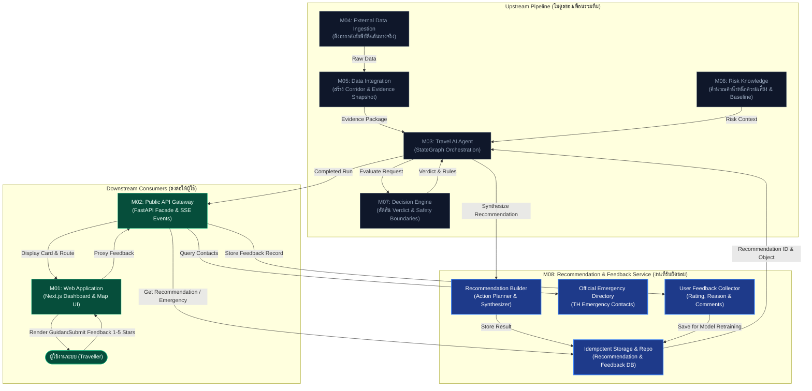

# LAB07: Module 08 — Travel Recommendation & User Feedback Service
> **Advanced Topic in Computer Software (ATCS-CPE)**  
> **โครงงานหลัก (Main Project):** [SafetyTravel Assistant (travel-safety-ai)](https://github.com/PROxTAE/travel-safety-ai)  
> **ผู้รับผิดชอบ (Author):** นายนิธิศ มะโนรา (รหัสนักศึกษา `116730462042-6`) — *Project Lead & Module 08 Engineer*  
> **Git Subtree Source:** [`services/recommendation/`](https://github.com/PROxTAE/travel-safety-ai/tree/main/services/recommendation)

---

## 📌 1. บทนำและบทบาทหน้าที่ (Module 08 Overview)

ในโครงงานแพลตฟอร์มผู้ช่วยวางแผนการเดินทางปลอดภัย **SafetyTravel Assistant (travel-safety-ai)** ระบบถูกออกแบบภายใต้สถาปัตยกรรม **Enterprise Microservices** แยกออกเป็น 8 โมดูลหลัก (M01–M08)

**โมดูล 08 (`services/recommendation`)** ทำหน้าที่เป็น **"ด่านสังเคราะห์ขั้นสุดท้าย (Final Synthesis & Action Planning Engine)"** ของระบบ โดยมีหน้าที่หลักคือ:
1. รับผลการวิเคราะห์และคำตัดสินความเสี่ยงเชิงลึกจาก **Decision Engine (M07)**, พิกัดเส้นทางและ Snapshot ภัยพิบัติจาก **Data Integration (M05)**, บริบทความเสี่ยงจาก **Risk Knowledge (M06)** ผ่านการประสานงานของ **AI Agent (M03)**
2. สังเคราะห์ผลลัพธ์ให้ออกมาเป็น **"คำแนะนำที่เข้าใจง่ายและนำไปปฏิบัติได้จริงสำหรับมนุษย์ (Actionable Travel Guidance)"**
3. จัดหมวดหมู่คำแนะนำออกเป็น 4 ระดับมาตรฐาน: 🟢 `NORMAL` · 🟡 `CHANGE_ROUTE` · 🟠 `DELAY` · 🔴 `AVOID`
4. ให้บริการ **User Feedback Loop** สำหรับรับคะแนนประเมิน (1–5 ดาว) และความคิดเห็นจากผู้ใช้งานจริง เพื่อนำไปใช้เป็นข้อมูลปรับปรุงและ Retrain โมเดล Machine Learning ในอนาคต
5. ให้บริการ **Official Emergency Numbers Directory** เชื่อมโยงเบอร์ติดต่อฉุกเฉินระดับทางการตามพิกัดภูมิศาสตร์จริง

🔗 **คลังซอร์สโค้ดหลักของโปรเจกต์:** [https://github.com/PROxTAE/travel-safety-ai](https://github.com/PROxTAE/travel-safety-ai)

---

## 🧩 2. แผนภาพการไหลของข้อมูลและการเชื่อมต่อระหว่างโมดูล (Cross-Module Data Flow)



---

## 🤝 3. ตารางการอ้างอิงและการเชื่อมโยงกับโมดูลของเพื่อนในทีม (Team Responsibility Matrix)

| โมดูล | ผู้รับผิดชอบ | รหัสนักศึกษา | บทบาทการทำงาน | การเชื่อมต่อกับ Module 08 |
| :---: | :--- | :---: | :--- | :--- |
| **M07** | **ปกครอง ทับโทน** | `116730462041-8` | Decision Engine (LLM & Rule-based Policy) | **ส่งเข้า M08:** Verdict (`NORMAL`/`CHANGE_ROUTE`/`DELAY`/`AVOID`), กฎความปลอดภัยที่ถูกทริกเกอร์, และคะแนนความเสี่ยงเชิงตัวเลข |
| **M05** | **สิรวิชญ์ ศิริสลุง** | `116730462023-6` | Data Integration & Spatial Corridor Engine | **ส่งเข้า M08:** Snapshot ของข้อมูลสภาพแวดล้อมที่จัดทำ Index ตลอดแนว Corridor เพื่อนำมาอ้างอิงเป็นเหตุผลในคำแนะนำ |
| **M04** | **ประภากรณ์ ภิธรรมมา** | `116730462033-5` | External Data Feeds & Live Adapters | **ส่งเข้า M08:** ข้อมูลสภาพอากาศ (Open-Meteo), ข้อมูลภัยพิบัติ (GDACS/USGS), สถานะการเดินทางจริง (OpenRouteService) |
| **M06** | **รัชชานนท์ ศรีไชย** | `116730462005-3` | Risk Knowledge Service | **ส่งเข้า M08:** เมทริกซ์ความเสี่ยงและระดับความรุนแรงตามมาตรฐานสากล |
| **M03** | **วิทยา จำรูญนุรักษ์** | `116610462040-4` | Travel AI Agent (LangGraph Orchestrator) | **ผู้ประสานงานหลัก:** เรียกใช้ API ของ Module 08 ใน Node `format_recommendation` และจัดการวงจรการทำงาน |
| **M02** | **กฤษณพงศ์ พรภู่** | `116730462018-6` | Public API Gateway & Core Backend | **รับจาก M08:** Endpoint ดึงคำแนะนำ `/api/v1/recommendations/{id}`, รับฟีดแบ็ก `/feedback`, และดึงเบอร์ฉุกเฉิน |
| **M01** | **เตชิษฏ์ จาดยางโทน** | `116730462040-0` | Web Frontend Application (Next.js 15) | **แสดงผลสู่ผู้ใช้:** นำ Action Items, Packing List, Route Advisories และแบบฟอร์ม Feedback ไปแสดงผลบนหน้าเว็บ |
| **M08** | **นิธิศ มะโนรา (ตนเอง)** | `116730462042-6` | **Recommendation & Feedback Service (Lead)** | **หน้าที่ตนเอง:** ออกแบบและพัฒนาระบบสังเคราะห์คำแนะนำ, ระบบบันทึก Feedback, Directory เบอร์ฉุกเฉิน, และประสานงานภาพรวมโปรเจกต์ |

---

## 🛠️ 4. ฟังก์ชันหลักและฟีเจอร์ที่พัฒนาใน Module 08 (Key Implementations)

### 4.1 Recommendation Synthesizer & Action Planner
- แปลงข้อมูลเชิงเทคนิคจาก Machine Learning ให้กลายเป็นภาษาที่เข้าใจง่าย
- จัดทำ **Action Plan**: สิ่งที่ต้องทำทันที (Immediate Actions), ข้อควรระวังระหว่างเดินทาง (En-route Precautions), และทางเลือกสำรอง (Alternative Suggestions)
- จัดเตรียม **Preparation Checklist (Packing List)**: เช่น ยาสามัญ, เสื้อกันฝน, เพาเวอร์แบงก์, อุปกรณ์รับมือสภาพอากาศรุนแรง
- จัดทำ **Risk Rationale (Why)**: ระบุสาเหตุที่ชัดเจนพร้อมแหล่งที่มาของข้อมูล (Provenance Attribution)

### 4.2 User Feedback Loop Engine
- รองรับการให้คะแนนความพึงพอใจและความแม่นยำ (Rating 1 ถึง 5 ดาว)
- รองรับการระบุหมวดหมู่ปัญหา เช่น `ACCURACY`, `TIMELINESS`, `ROUTE_QUALITY`, `SAFETY_ADVICE`
- บันทึกคอมเมนต์และบริบทการใช้งาน เพื่อนำไปสร้าง Benchmark Dataset สำหรับการปรับปรุงโมเดลในอนาคต

### 4.3 Official Emergency Contacts Directory
- บริการค้นหาเบอร์โทรฉุกเฉินระดับชาติอย่างเป็นทางการ (Official Authority Contacts)
- รองรับเบอร์สำคัญของประเทศไทย: 191 (ตำรวจ), 1669 (กู้ชีพฉุกเฉิน), 1155 (ตำรวจท่องเที่ยว), 1193 (ตำรวจทางหลวง), 199 (ดับเพลิง)
- ปฏิบัติตาม **Zero-Mock Policy**: คืนค่าเฉพาะข้อมูลที่มีการตรวจสอบยืนยันแล้วเท่านั้น

### 4.4 Idempotency & Contract Enforcement
- รองรับการดึงข้อมูลซ้ำผ่าน `recommendation_id` โดยไม่เกิดการคำนวณซ้ำซ้อน
- รองรับ Envelope รูปแบบมาตรฐาน: `DataResponse[T]`, `ListResponse[T]`, `ErrorEnvelope` ตามข้อตกลง **OpenAPI v1.0.0**

---

## 📂 5. โครงสร้างโฟลเดอร์ซอร์สโค้ด (Subtree Structure)

```text
LAB07/
├── module-08-recommendation/      # Git Subtree ดึงมาจาก services/recommendation
│   ├── app/
│   │   ├── api/                   # FastAPI Endpoints (internal.py)
│   │   ├── builders/              # กลไกสร้างคำแนะนำ (recommendation_builder.py)
│   │   ├── domain/                # โมเดลตรรกะทางธุรกิจและ Feedback (feedback.py)
│   │   ├── directory/             # ระบบค้นหาเบอร์ฉุกเฉินตามพิกัด (emergency.py)
│   │   ├── repositories/          # ฐานข้อมูลและการจัดเก็บผลลัพธ์
│   │   ├── observability.py       # Metrics & Structured Logging
│   │   ├── models.py              # Pydantic Schemas & DTOs
│   │   ├── settings.py            # Environment Configuration
│   │   └── main.py                # Service Entrypoint
│   ├── emergency-directory/       # ฐานข้อมูลเบอร์ฉุกเฉินทางการ (JSON Data)
│   ├── migrations/                # Database Migrations (Alembic)
│   ├── tests/                     # Unit Tests & Contract Verification Tests
│   ├── Dockerfile                 # Container Image Definition
│   ├── pyproject.toml             # Python Dependencies & Tooling (uv)
│   └── README.md                  # Service Documentation
└── README.md                      # เอกสารอธิบายภาพรวม LAB07 (ไฟล์นี้)
```

---

## 🚀 6. การทดสอบและการรันระบบ (Testing & Verification)

### รัน Unit Tests ของ Module 08:
```bash
cd LAB07/module-08-recommendation
uv run pytest
```

### ตรวจสอบ Linting และ Formatting:
```bash
uv run ruff check .
uv run ruff format --check .
uv run mypy app
```

### การรันผ่าน Docker ในระบบรวม (จาก Project หลัก):
```bash
docker compose -f compose.yaml -f compose.dev.yaml up -d recommendation
```

---

## 📚 7. แหล่งอ้างอิง (References & Project Links)
- **Main Project Repository:** [PROxTAE/travel-safety-ai](https://github.com/PROxTAE/travel-safety-ai)
- **Course Repository:** [Advanced Topic in Computer Software Course (อ.อนุรักษ์ พรหมโคตร)](https://github.com/aproot-en/Advanced-Topic-in-Computer-Software-Course)
- **OpenAPI Contract Specification:** `packages/contracts/openapi/internal-recommendation.yaml`
- **WMO Standard Weather Codes:** [World Meteorological Organization](https://www.wmo.int/)
